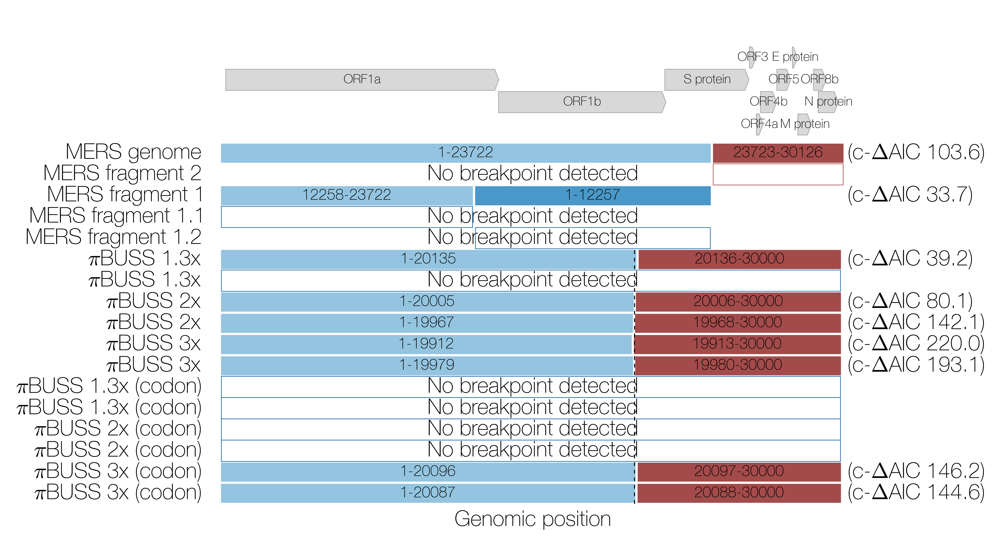
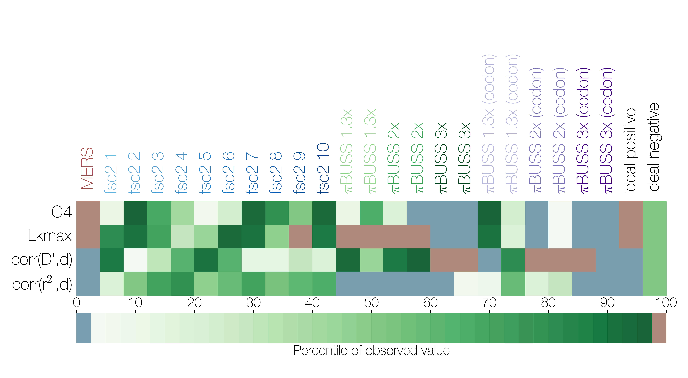
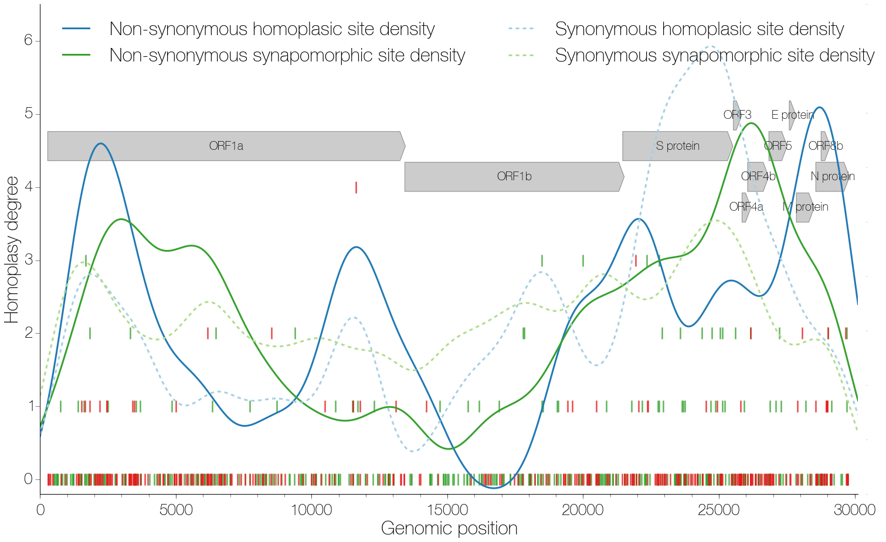
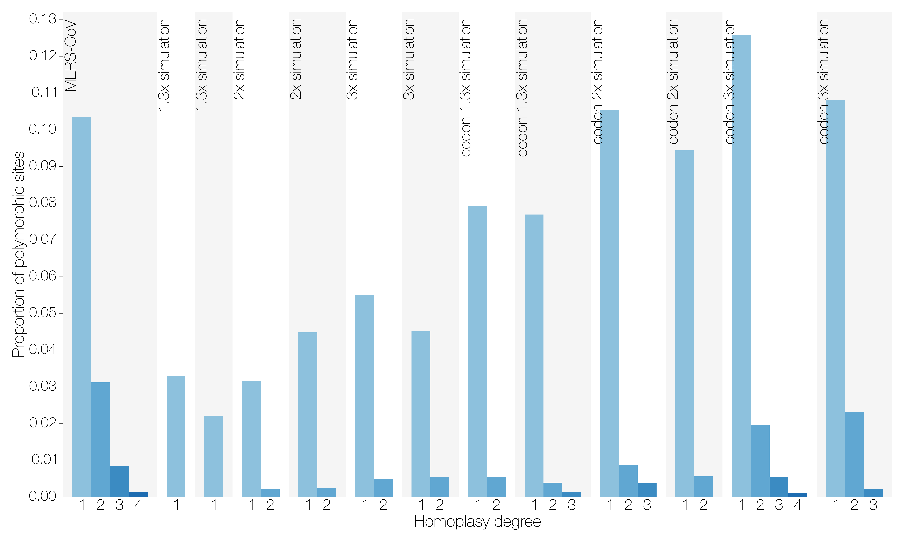
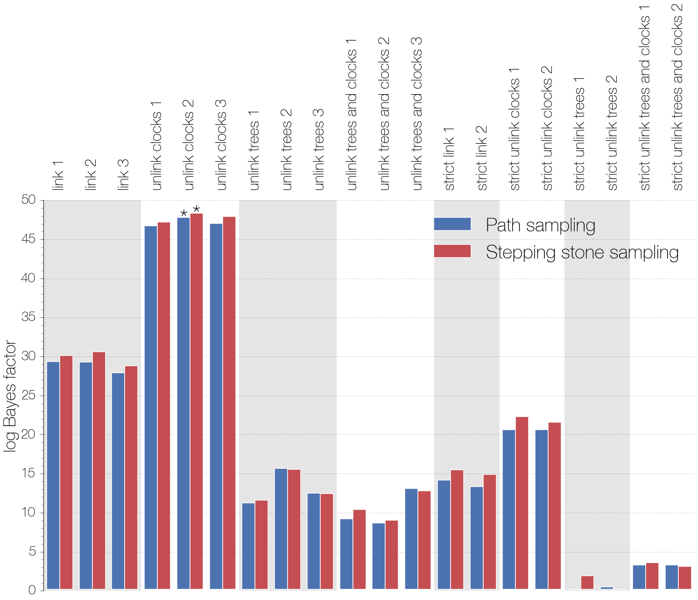
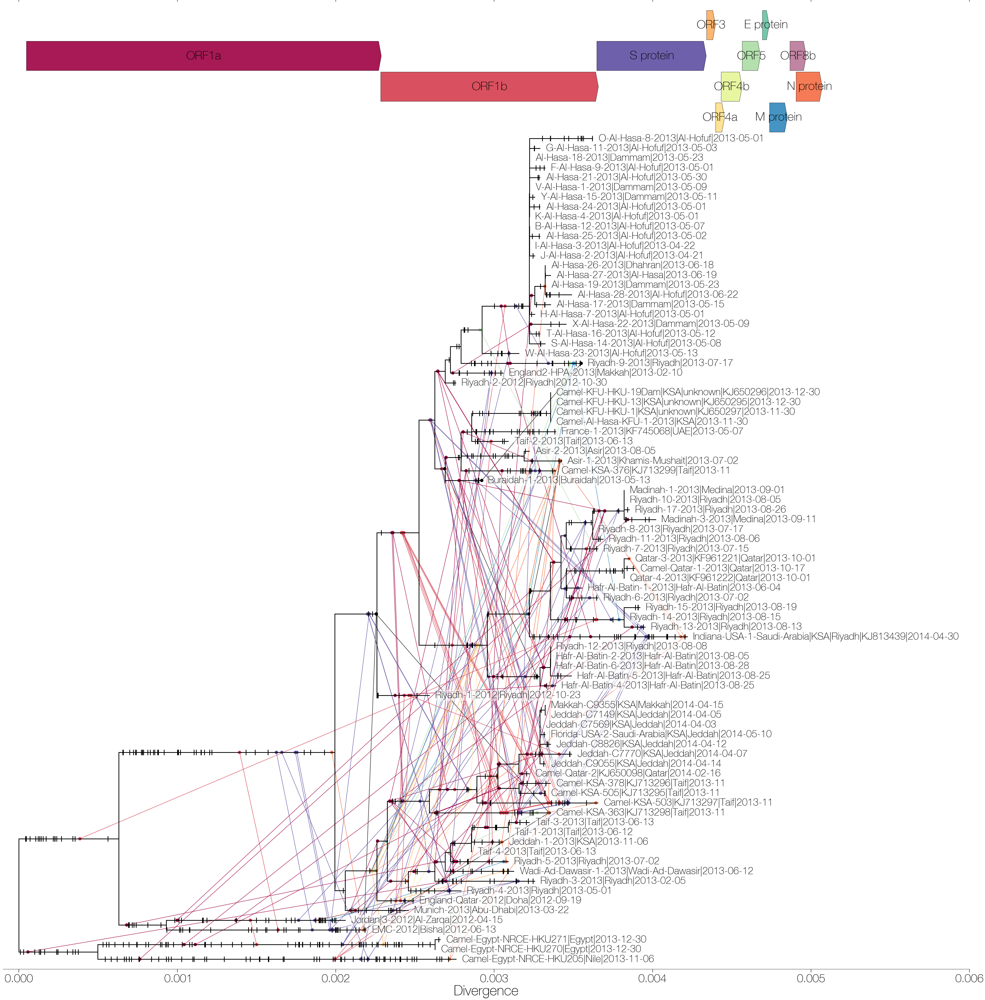

## MERS-CoV recombination: implications about the reservoir and potential for adaptation
Gytis Dudas1 and Andrew Rambaut1,2,3

1Institute of Evolutionary Biology, University of Edinburgh, Edinburgh, UK,
2Fogarty International Center, National Institutes of Health, Bethesda, MD, USA,
3Centre for Immunology, Infection and Evolution at the University of Edinburgh, Edinburgh, UK

### Abstract
Recombination is a process that unlinks neighbouring loci, allowing for independent evolutionary trajectories within genomes of many organisms. If not properly accounted for, recombination can compromise many evolutionary analyses. In addition, when dealing with organisms that are not obligately sexually reproducing, recombination gives insight into the rate at which distinct genetic lineages come into contact. Since June, 2012, Middle East respiratory syndrome coronavirus (MERS-CoV) has caused 927 laboratory-confirmed infections, with 338 MERS-CoV associated deaths as of December 2, 2014. Although bats are considered as the likely ultimate source of zoonotic coronaviruses, dromedary camels have been consistently implicated as the source of current human infections in the Middle East. In this paper we use phylogenetic, population genetics and model testing methods and simulations to show that MERS-CoV genome contains a problematic pattern of rate heterogeneity and has likely undergone numerous recombinations recently.

==============================

**Summary of GARD results.**
Coloured boxes indicate fragments resulting from GARD-inferred breakpoints with corrected Δ-AIC values shown on the right. Dashed line indicates the actual position where the evolutionary model for πBUSS-simulated sequences under 3 levels of rate heterogeneity is changed. Arrows at the top indicate the positions and names of coding sequences within the MERS-CoV genome.

**Summary of non-parametric tests for recombination from LDhat analyses.**
The percentile of the observed value for 4 statistics, shown on the y axis, of LD decay in the distribution of permuted datasets is indicated by colour. Sequence datasets are shown on the x axis, starting with MERS-CoV sequences, followed by 10 fastsimcoal2-simulated datasets and 6 πBUSS-simulated datasets with different degrees of rate heterogeneity. Expected values for ideal datasets are shown in the last two columns, an ideal positive corresponds to the presence of recombination. Values falling between the 5th and 95th percentile are shown in green, values falling below the 5th percentile are in blue, those that are above the 95th percentile in red.

**Distribution of homoplasies as determined by ClonalFrameML.**
Position along the genome is shown on the x axis and homoplasy degree, the number of times a particular mutation has occured in excess in the tree, is shown on the y axis. Individual mutations are marked by vertical lines, synonymous ones in green and non-synonymous in red. Kernel density estimates of homoplasic/synapomorphic and synonymous/non-synonymous sites are shown as blue and green lines. Arrows at the top indicate the positions and names of coding sequences within the MERS-CoV genome.

**Homoplasy prevalence in MERS-CoV and simulated datasets.**
Bars show the proportion of all polymorphic sites that are homoplasic, split by homoplasy degree as inferred by ClonalFrameML, in MERS-CoV and πBUSS-simulated datasets. Homoplasy degree indicates how many times a given mutation has occured in excess in the phylogenetic tree.

**Summary of model comparisons.**
Difference in marginal likelihoods (Bayes factor) between the worst model (linked strict molecular clock, unlinked trees) and all others. Asterisks indicate the best-performing model (unlinked relaxed clocks, linked trees, run 2) for MERS-CoV data. Analyses employing a relaxed molecular clock were run independently 3 times, those with a strict molecular clock 2 times.

**Mutations mapped onto a ML phylogeny.**
A maximum likelihood phylogeny of 85 MERS-CoV sequences with ClonalFrameML-mapped mutations. Synapomorphies are shown as black ticks on branches where they occur. Homoplasies are shown as circles connected with coloured lines, colour corresponds with the coding sequence in which the mutation has occured. Mutations are positioned on the branches in proportion to where the mutation occurs in the genome, *e.g.* mutations shown towards the end of a branch correspond to mutations near the 3' terminus of the genome. Arrows at the top indicate the positions and names of coding sequences within the MERS-CoV genome.

**Homoplasies mapped onto a ML phylogeny.** (alternative to figure above)
A maximum likelihood phylogeny of 85 MERS-CoV sequences with ClonalFrameML-mapped homoplasies. Homoplasies are connected to the genomic positions where they occur, colour corresponds with the coding sequence in which the mutation has occured. Arrows at the top indicate the positions and names of coding sequences within the MERS-CoV genome.
