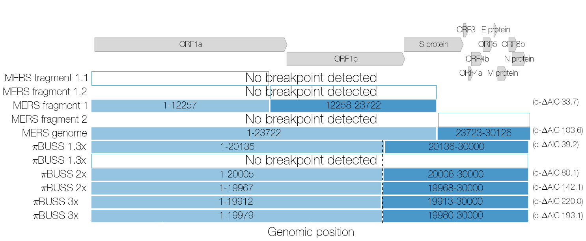
Summary of GARD results.
--------------------------------
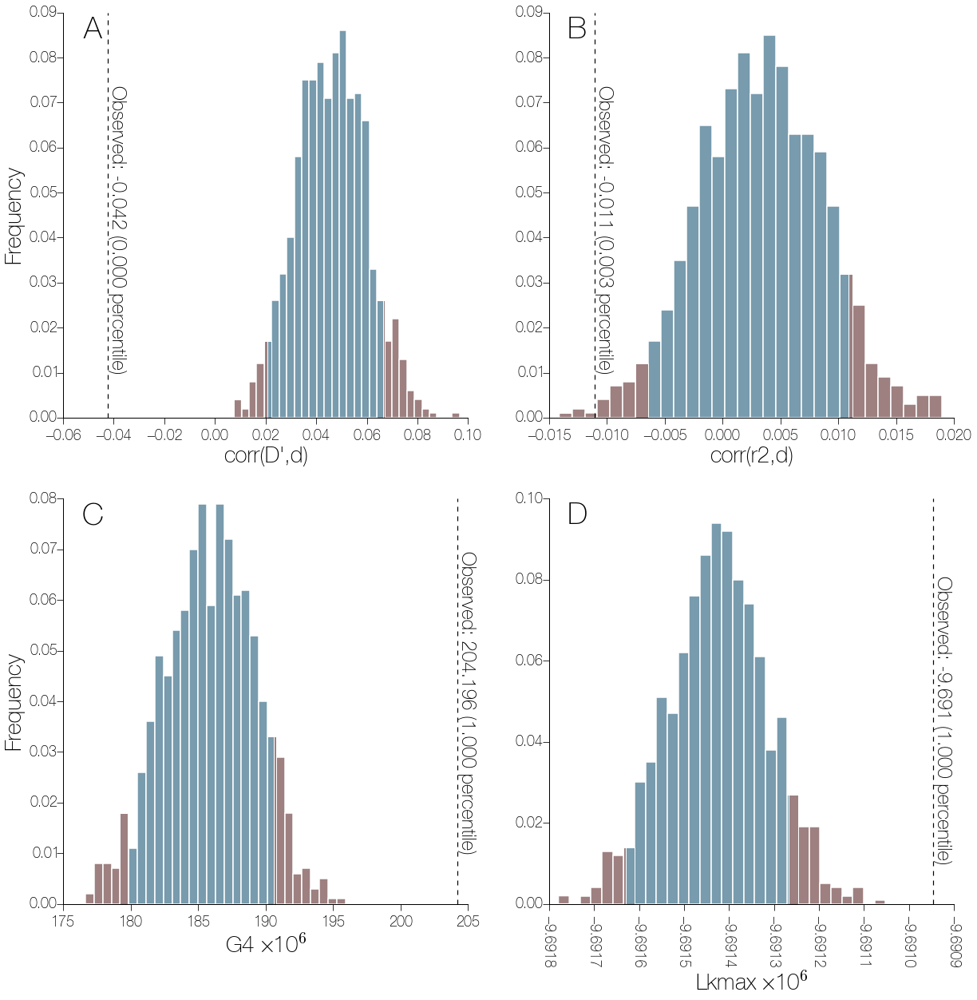
LDhat permutation test results for recombination in MERS.
--------------------------------
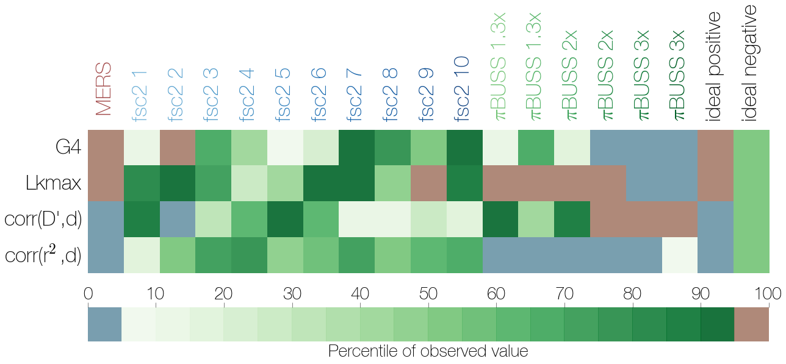
Summary of LDhat permutation tests on simulated non-recombining data.
--------------------------------
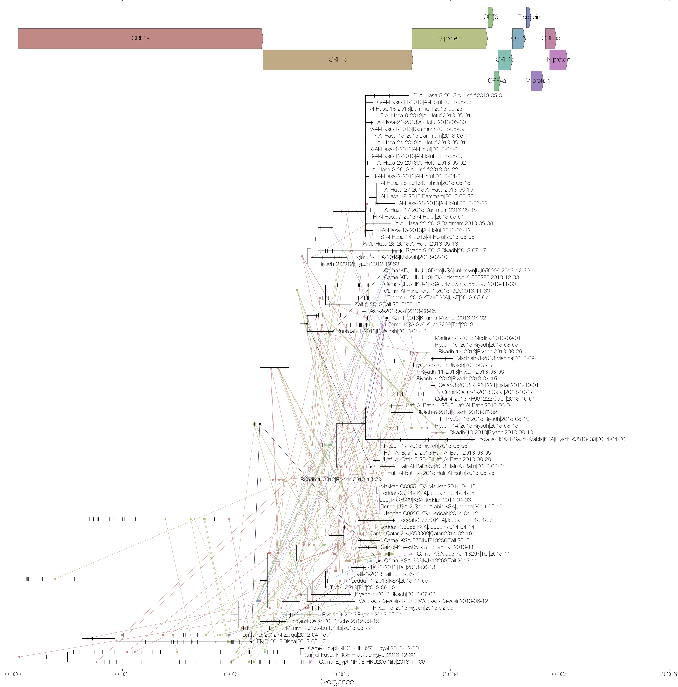
Mapping of synapomorphies (bars on branches) and homoplasies (line connecting branches) on the maximum likelihood phylogeny of MERS.
--------------------------------
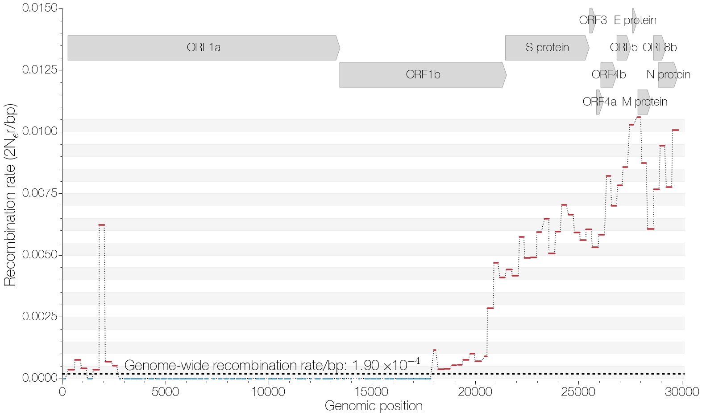
Estimated recombination rate across the MERS genome in 300nt windows.
--------------------------------
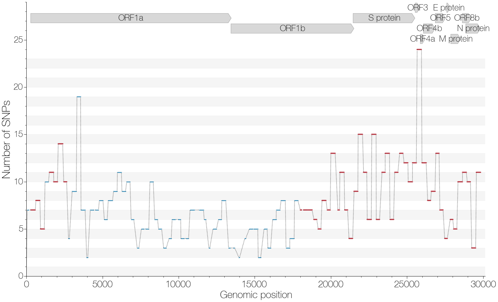
Numbers of SNPs across the MERS genome in 300nt windows.
--------------------------------
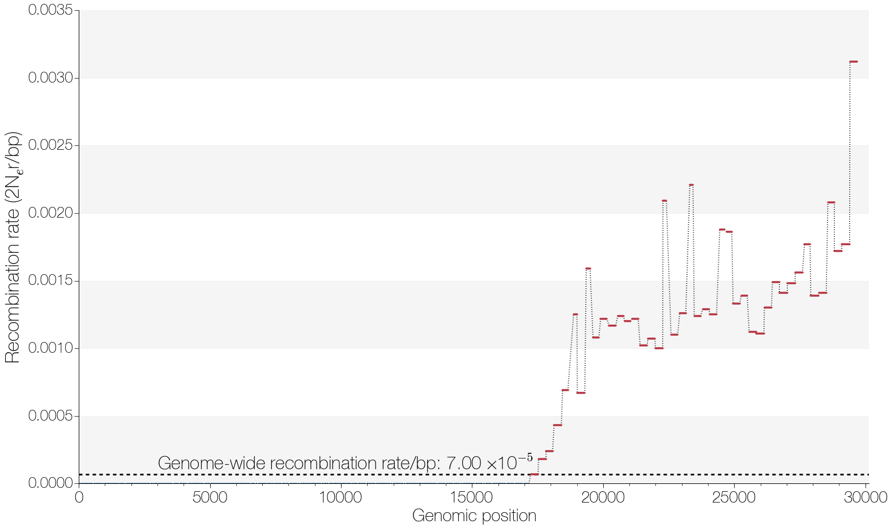
Estimated recombination rate across simulated non-recombining genome with rate heterogeneity (1.3x) in 300nt windows.
--------------------------------
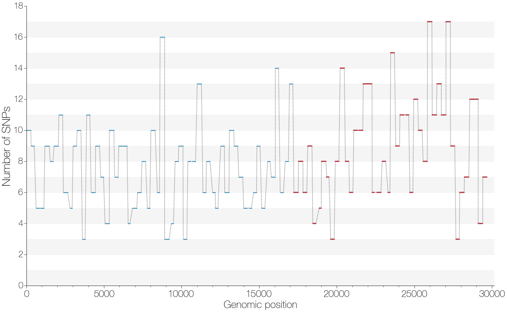
Numbers of SNPs across simulated genome in 300nt windows.
--------------------------------
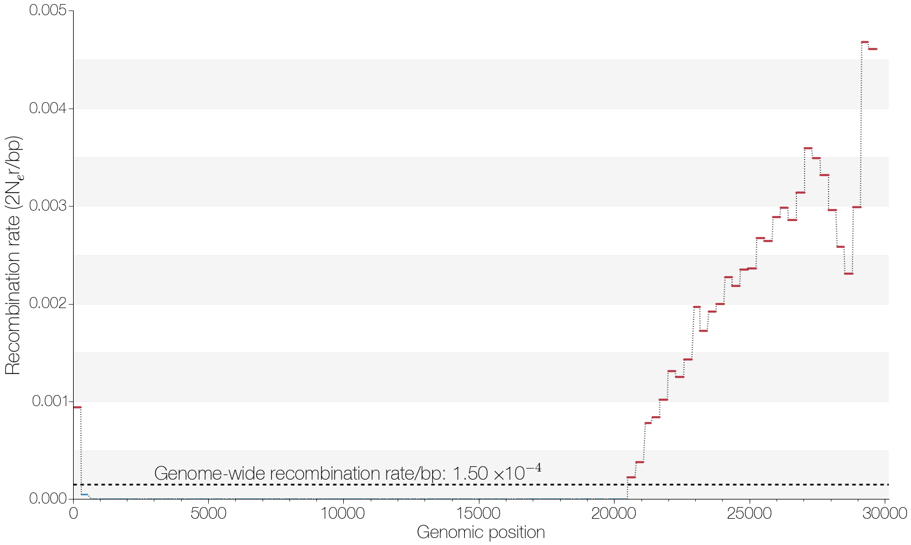
Estimated recombination rate across simulated non-recombining genome with rate heterogeneity (3x) in 300nt windows.
--------------------------------
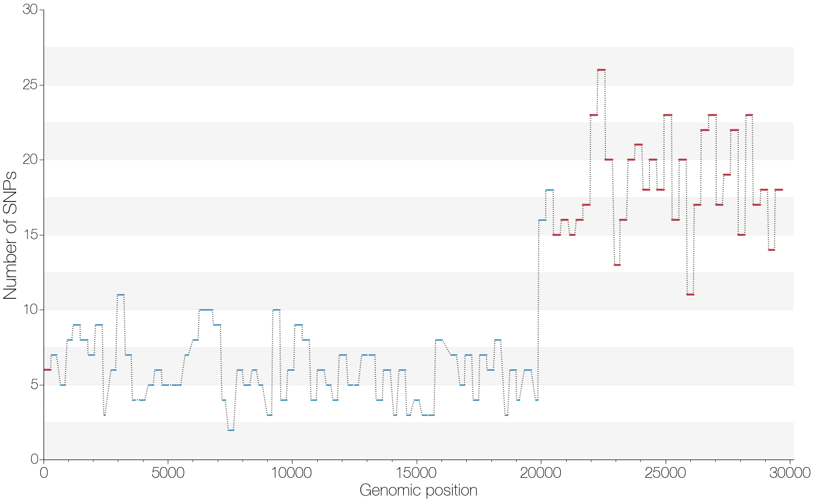
Numbers of SNPs across simulated genome in 300nt windows.
--------------------------------
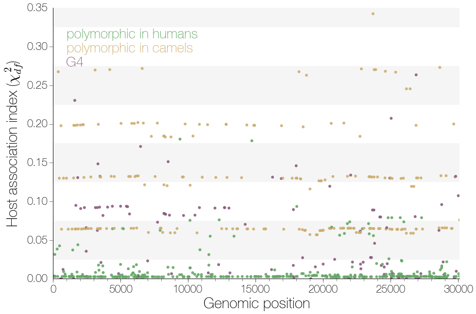
r2 statistic of association between particular alleles and human vs camel host.
--------------------------------
